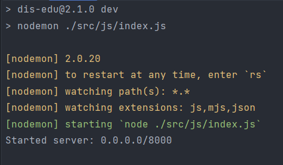
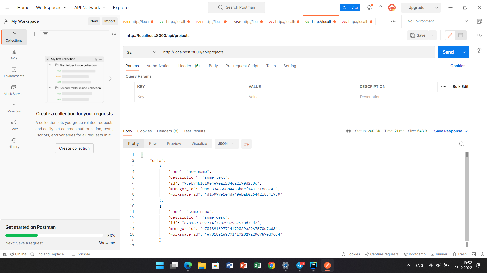
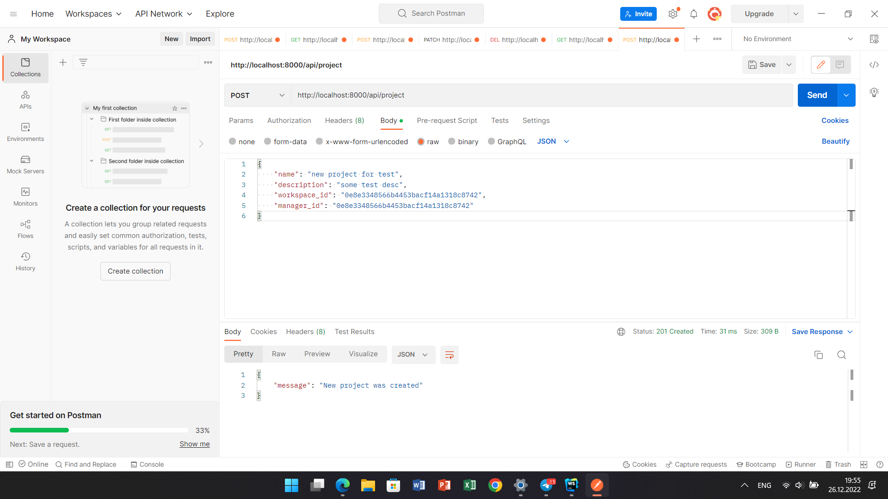
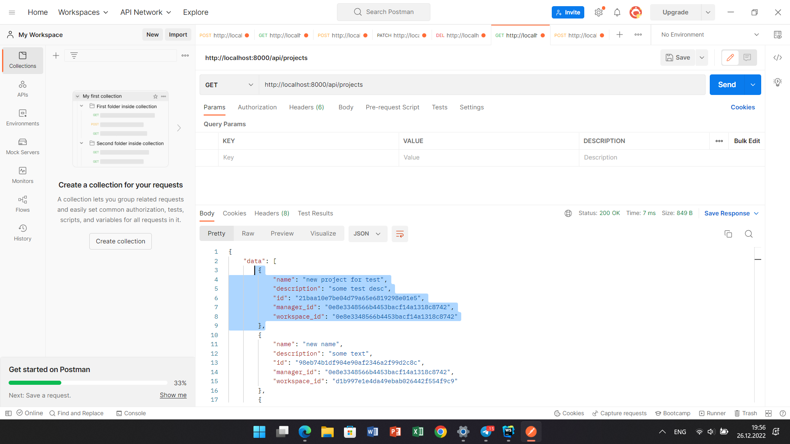
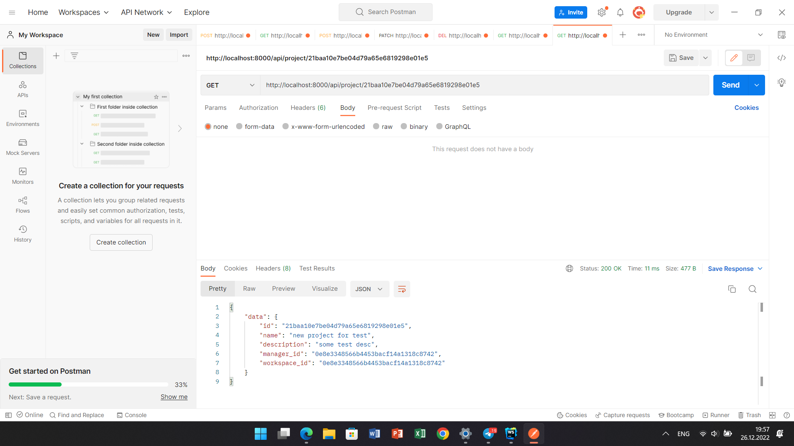
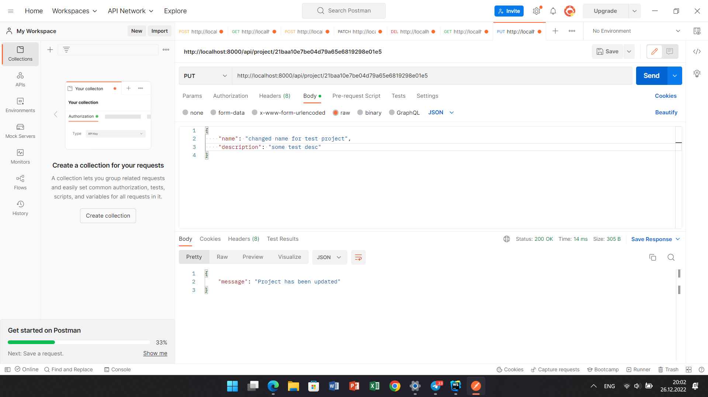
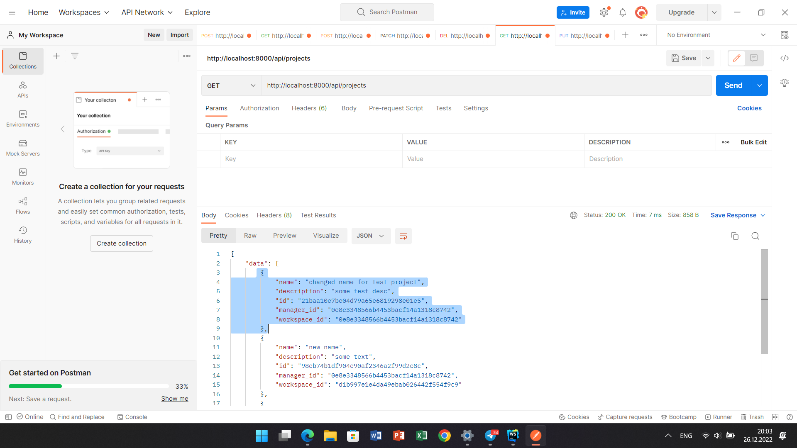
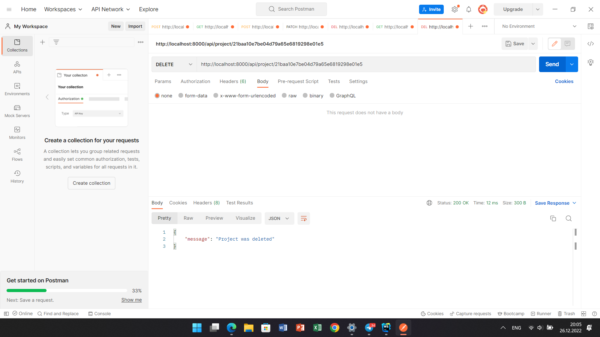
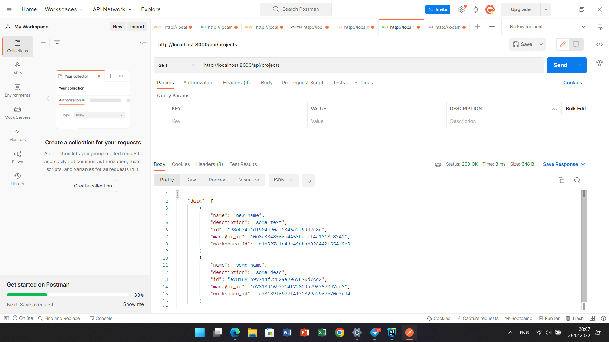

# Тестування працездатності системи

*В цьому розділі необхідно вказати засоби тестування, навести вихідні коди тестів та результати тестування.*

## Термінал сервера

## Відображення всіх сутностей

## Додавання сутності (CREATE)

### Запит

### Результат

## Зчитування сутності по id (READ)

### Результат

## Оновлення сутності по id (UPDATE)

### Запит

### Результат

## Видалення сутності (DELETE)

### Початковий стан списку

### Запит

### Результат

